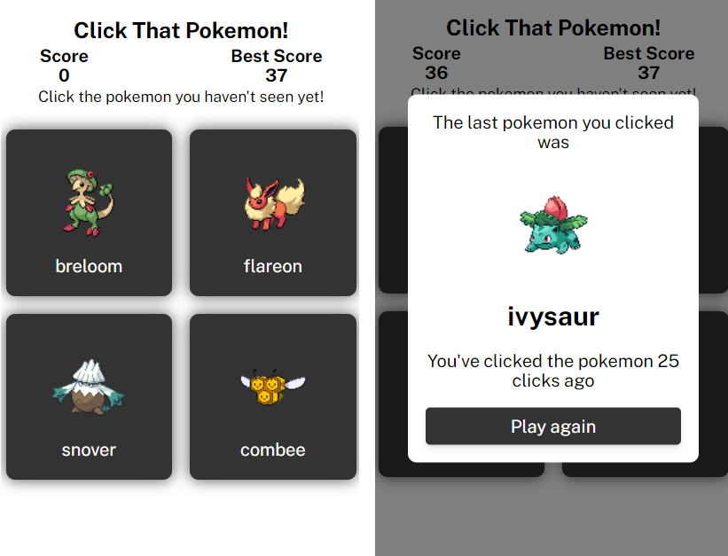

# memory-card

Memory Card project for The Odin Project. Made with React.

## Demo

[Live Preview](http://nevz9.github.io/memory-card)

## Screenshots

## Lessons Learned

I've learned a lot from this project. Taught me about functional components and how to use hooks. Although some hooks weren't required in this project, it was fun reading the docs for it, like useReducer and useContext. Especially useContext it's great to have a direct connection between components, which reduces too much passing of props through different components. It's not that much in this project, but I can see it being useful for deeply nested components.

useReducer isn't really necessary in my code, I can also just use useState and bundle my states into one object, but it's still very nice to practice it.

There's still a lot more to learn, and features/stylings to add. For now I will just move forward.

## Acknowledgements

- [The Odin Project](https://www.theodinproject.com/)
- [Design Inspiration](https://fernaned.github.io/memory-game/)
